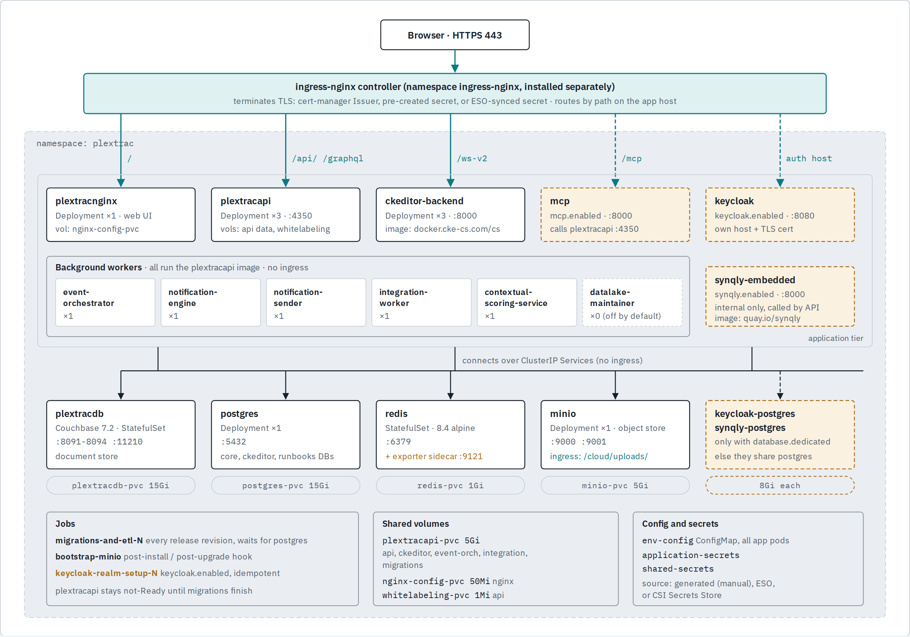

# PlexTrac on Kubernetes

`charts/plextrac` · chart 2.28.0

What the Helm chart runs, how traffic reaches it, and every container registry a cluster needs to pull from. Built from `helm template` output with all optional components turned on, so the optional pieces show up too.

<picture>
  <source media="(prefers-color-scheme: dark)" srcset="images/plextrac-topology-dark.png">
  
</picture>

**Key:** solid teal line = ingress route (path or host) · solid box = always deployed · dashed amber box = optional, off by default (flag shown in the box)

Everything outside the ingress path is internal. The browser only ever talks to ingress-nginx, which sends `/` to the web UI, `/api/` and `/graphql` straight to plextracapi, `/ws-v2` to CKEditor, and `/cloud/uploads/` to MinIO. The API, CKEditor and the workers reach the data stores by Service name (`plextracdb`, `postgres`, `redis`, `minio`). Replica counts are chart defaults.

## Registries the cluster pulls from

Split into what the PlexTrac chart itself needs and what the cluster prerequisites need. Setting `global.image.registry` re-homes every chart image to a mirror except CKEditor and Synqly, which set their own registry and have to be overridden one by one.

### PlexTrac chart images

| Registry | Images | When | Pull credentials |
|---|---|---|---|
| `docker.io` | `plextrac/plextracapi` (API, workers, jobs) `plextrac/plextracnginx` `plextrac/plextracdb` `plextrac/plextracpostgres` `plextrac/minio`, `plextrac/plextrac-minio-bootstrap` | required | **PlexTrac-issued Docker Hub login** `internal-registry-creds` |
| `docker.io` | `redis:8.4.0-alpine` (official image) | required | Public |
| `docker.cke-cs.com` | `cs` (CKEditor collaboration server) | required | **CKEditor login** `ckeditor-registry-creds` |
| `docker.io` | `plextrac/plextrac-keycloak` | `keycloak.enabled` | Same Docker Hub login |
| `docker.io` | `plextrac/mcp` | `mcp.enabled` | Same Docker Hub login |
| `quay.io` | `synqly/embedded` | `synqly.enabled` | **Separate quay.io login** Requires its own quay.io pull secret. |
| `docker.io` | `oliver006/redis_exporter:latest` | `redis.metrics.enabled` | Public |

### Cluster prerequisites

| Registry | Images | When | Pull credentials |
|---|---|---|---|
| `registry.k8s.io` | `ingress-nginx/controller`, `ingress-nginx/kube-webhook-certgen` | required | Public |
| `docker.io` | `rancher/*`: klipper-lb, local-path-provisioner, mirrored-coredns-coredns, mirrored-metrics-server, mirrored-pause, klipper-helm, mirrored-library-busybox | K3s installs | Public |
| `quay.io` | `jetstack/cert-manager-controller`, `-webhook`, `-cainjector`, `-startupapicheck` | cert-manager TLS | Public |
| `ghcr.io` | `external-secrets/external-secrets` | `secrets.mode: externalSecrets` | Public |
| `registry.k8s.io` | `csi-secrets-store/driver`, `driver-crds`, `sig-storage/csi-node-driver-registrar`, `sig-storage/livenessprobe`, plus your cloud provider's plugin | `secrets.mode: csi` | Public |

### Firewall allowlist for Docker Hub

Pulling from docker.io actually hits `registry-1.docker.io`, `auth.docker.io` and `production.cloudflare.docker.com`. quay.io, ghcr.io and registry.k8s.io also redirect layer downloads to CDN hosts, so allowlisting just the registry name isn't enough.

### Non-image downloads during install

`get.k3s.io` and `github.com` (K3s binary), `kubernetes.github.io` (ingress-nginx chart), `charts.jetstack.io` (cert-manager chart), and the PlexTrac helm-charts repo on GitHub.

### Versions

Prerequisite image lists come from the latest upstream charts and the latest K3s release (v1.37.0+k3s1) as of 23 Sep 2026. Pinned chart versions can pull different tags, but the registries stay the same.
